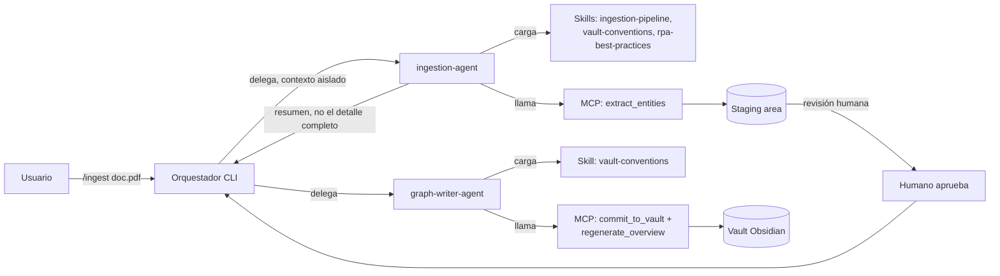
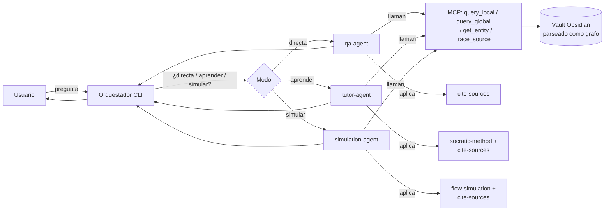

# Arquitectura v0.1 — Proyecto de Base de Conocimiento para Soporte de RPA

> Estado: diseño inicial, sin código. Objetivo de este documento: fijar los principios, capas y decisiones técnicas que guiarán la construcción del MVP.

## 0. Problema y principios de diseño

**Problema:** entender procesos de negocio y técnicos de proyectos RPA legados cuesta mucho tiempo porque el conocimiento está fragmentado en documentos heterogéneos (PDF, docx, xlsx, notas, md) sin relaciones explícitas entre reglas, sistemas y excepciones.

**Principios que rigen todas las decisiones de abajo:**

1. **Portabilidad primero.** Nada del núcleo debe depender de un solo proveedor de LLM o de un solo CLI. El motor se expone como servidor MCP; los agentes usan el estándar abierto Agent Skills.
2. **El grafo es la fuente de verdad, no el chat.** Toda respuesta del agente debe poder trazarse a un nodo/relación concreto del grafo con su documento origen. Sin esto, el riesgo de alucinación en procesos con impacto en pagos/RRHH/compliance es inaceptable.
3. **Empezar pequeño y verificable.** MVP = 1 proyecto RPA real tuyo, no un framework genérico. Generalizar después de validar con un caso real.
4. **Gobernanza incluida desde el diseño**, no como afterthought — si nadie actualiza el grafo, se vuelve documentación muerta otra vez.
5. **El grafo debe ser legible por humanos, no solo por máquinas.** El mismo artefacto que alimenta al motor debe poder explorarse visualmente — clave para el objetivo de aprendizaje activo.

---

## 1. Arquitectura en capas

```
┌────────────────────────────────────────────────────────────-----┐
│  CLI (Claude Code / OpenCode / Codex CLI...)                    │
│  → Skills (estándar abierto) + Subagentes específicos de cada  │
│    herramienta, todos delgados: orquestan, no re-implementan    │
└───────────────────────────┬───────────────────────────────────--┘
                             │ MCP
┌───────────────────────────▼───────────────────────────────────┐
│  MOTOR (servidor MCP, agnóstico de CLI y de modelo)            │
│                                                                │
│   ┌───────────────┐  ┌────────────────┐  ┌──────────────────┐  │
│   │  Ingestión     │→ │ Vault Obsidian │→ │  Retrieval       │
│   │  multi-formato │  │ (grafo en .md) │  │  (GraphRAG híbrido)│
│   └───────────────┘  └────────────────┘  └──────────────────┘  │
│           │                    │                    │          │
│   ┌───────▼────────────────────▼────────────────────▼────   │
│   │        Índice vectorial (embeddings de notas)           │  │
│   └─────────────────────────────────────────────────────────┘  │
└─────────────────────────────────────────────────────────────---┘
```

Future: **Por qué MCP como frontera:** desacopla "cómo pregunto" (CLI/agente) de "cómo se responde" (grafo + retrieval). El motor no sabe ni le importa si lo llama Claude Code o OpenCode.

---

## 2. Capa de ingestión (prioridad 1)

Objetivo: convertir documentos heterogéneos en unidades normalizadas listas para extracción de entidades.

**Pipeline propuesto:**

1. **Normalización de formato** → texto/markdown estructurado.
   - PDF → extracción de texto + tablas + OCR si es escaneado.
   - docx/xlsx → conversión preservando estructura (encabezados, tablas, hojas).
   - Notas/md/txt → passthrough con limpieza mínima.
2. **Chunking consciente de estructura**, no por tamaño fijo — respetar límites de sección, tabla, paso de proceso.
3. **Extracción de entidades y relaciones vía LLM con salida estructurada (JSON schema forzado)**, chunk por chunk, con contexto del documento completo cuando el chunk lo requiera.
4. **Revisión humana obligatoria antes de escribir al vault** (staging area) — mitiga el riesgo de "grafo contaminado por extracción mala".
5. **Trazabilidad**: cada nodo/relación guarda `source_doc`, `source_span`, `extracted_by` (modelo+fecha), `confidence`.

**Formato de destino:** cada documento normalizado + su extracción vive como un artefacto versionable (texto plano/JSON en git), de modo que el histórico de ingestión sea auditable con `git log`.

---

## 3. Esquema del grafo (propuesta inicial para dominio RPA)

**Tipos de nodo:**

| Nodo                | Ejemplo                                         |
| ------------------- | ----------------------------------------------- |
| `Proceso`           | "Conciliación de facturas proveedor X"          |
| `PasoDeProceso`     | "Validar campo NIT contra ERP"                  |
| `ReglaDeNegocio`    | "Si monto > $5M, requiere aprobación gerencial" |
| `Sistema`           | "SAP", "Excel origen", "Portal proveedor"       |
| `CampoDeDato`       | "NIT", "Monto factura"                          |
| `Excepcion`         | "NIT no encontrado en ERP"                      |
| `HistoriaDeUsuario` | HU-014                                          |
| `Robot/Bot`         | "Bot_ConciliacionFacturas"                      |
| `Documento`         | fuente original, con metadata                   |

**Tipos de relación (ejemplos):**

- `PasoDeProceso -[SIGUIENTE_A]-> PasoDeProceso`
- `PasoDeProceso -[APLICA_REGLA]-> ReglaDeNegocio`
- `PasoDeProceso -[INTERACTUA_CON]-> Sistema`
- `Excepcion -[OCURRE_EN]-> PasoDeProceso`
- `ReglaDeNegocio -[DEPENDE_DE]-> CampoDeDato`
- `HistoriaDeUsuario -[IMPLEMENTADA_POR]-> PasoDeProceso`
- `* -[EXTRAIDO_DE]-> Documento` (trazabilidad, en todos los nodos)

Este esquema es deliberadamente pequeño para el MVP — se amplía solo cuando un caso real lo exija, no especulativamente.

---

## 4. Almacenamiento: vault de Obsidian como grafo

En vez de una base de grafo formal desde el día 1, el MVP usa un **vault de Obsidian (carpeta de archivos `.md`)** como almacenamiento del grafo. Es storage real, no solo una vista bonita:

- Cada nodo del esquema (sección 3) = **una nota `.md`**.
- Frontmatter YAML obligatorio para metadata y tipo de nodo.
- Relaciones **tipadas** como secciones estructuradas con encabezado fijo — no wikilinks sueltos en prosa, porque un link suelto no dice si es "depende de", "aplica en" o "es excepción de".

Ejemplo de nota:

```markdown
---
tipo: ReglaDeNegocio
id: RN-003
source_doc: "[[Manual_Conciliacion_v3.docx]]"
confidence: alta
last_verified_date: 2026-06-01
---

# RN-003 — Aprobación gerencial para montos altos

Si el monto de la factura supera $5.000.000, el proceso requiere
aprobación de un gerente antes de continuar.

## Depende de

- [[CampoDeDato - Monto factura]]

## Aplica en

- [[PasoDeProceso - Validar monto]]

## Excepciones conocidas

- [[Excepcion - Monto ambiguo por moneda]]
```

**Cómo se convierte en un grafo consultable:** un parser (frontmatter + `networkx`) reconstruye el grafo en memoria al arrancar el motor MCP, leyendo el frontmatter y esas secciones con encabezado fijo. El resto de la nota (prosa libre) alimenta el índice vectorial para búsqueda semántica, pero no el traversal.

**Por qué esta elección y no una base de grafo formal desde ya:**

- El mismo artefacto sirve como (a) fuente de datos para el motor MCP y (b) mapa visual navegable por humanos en la app Obsidian — el usuario nuevo literalmente _ve_ el proceso antes de preguntarle nada al agente.
- Cero infraestructura: `git clone && abrir carpeta en Obsidian` ya es usable, clave para adopción open-source.
- Es texto plano versionable con git — el histórico de cambios del proceso queda auditable gratis.

**Límite conocido:** parsear todo el vault en cada arranque no escala a cientos de proyectos grandes. Migración prevista: mismo esquema de nodos/relaciones → Kùzu o Neo4j Community como backend cuando el volumen lo justifique, con el vault manteniéndose como vista humana sincronizada. Cambio de backend, no de arquitectura.

---

## 5. Retrieval (GraphRAG híbrido)

Dos modos de consulta, elegidos según la pregunta:

- **Local search**: pregunta apunta a una entidad concreta ("¿qué pasa si el NIT no existe?") → se localiza la nota/nodo, se expande su vecindario (1-2 saltos siguiendo las secciones tipadas), se combina con el texto libre de las notas vía embeddings para el detalle fino.
- **Global search**: pregunta sobre el proceso completo ("explícame el flujo de principio a fin") → se recorre el grafo en orden topológico de `SIGUIENTE_A` y se sintetiza.

El motor MCP expone ambos como tools separadas (`query_local`, `query_global`, `get_entity`, `trace_source`) para que los agentes decidan cuál usar.

---

## 6. Capa de agentes: skills y subagentes

Una vez el motor MCP responde de forma confiable (Fase 2), se construye esta capa encima. Hay dos categorías de skills y un conjunto de subagentes que las combinan.

### 6.1 Skills genéricas (núcleo del framework — reusables en cualquier proyecto RPA)

Estas skills no saben nada sobre un proceso de negocio específico. Encapsulan _método_, no _contenido_.

| Skill                | Qué hace                                                                                                                                                       | Sabe sobre RPA en general                                                 |
| -------------------- | -------------------------------------------------------------------------------------------------------------------------------------------------------------- | ------------------------------------------------------------------------- |
| `ingestion-pipeline` | Orquesta normalización + chunking + extracción (sección 2)                                                                                                     | No                                                                        |
| `vault-conventions`  | La "gramática" compartida: cómo escribir/leer notas del vault (frontmatter, secciones tipadas, naming) — la usa cualquier skill o subagente que toque el vault | No                                                                        |
| `cite-sources`       | Política transversal: toda afirmación debe traer `[[Documento]]` de origen; si no hay fuente en el grafo, decir explícitamente que no se sabe, nunca inventar  | No                                                                        |
| `socratic-method`    | Técnica pedagógica genérica: convierte una respuesta directa en una secuencia de preguntas guía, evalúa la respuesta del usuario contra el nodo del grafo      | No                                                                        |
| `flow-simulation`    | Motor genérico de "qué pasa si": camina relaciones tipadas del grafo que se le pase y compone escenarios                                                       | No                                                                        |
| `rpa-best-practices` | Conocimiento general de la industria RPA: patrones comunes de excepciones, convenciones de nombres de bots, checklist de puntos ciegos típicos                 | Sí — pero es conocimiento de industria, no de un cliente/proceso concreto |

### 6.2 Artefactos específicos del proceso (generados, no escritos a mano)

No son skills que alguien redacta — se generan a partir de la ingestión de cada proyecto:

- **El vault del proyecto** — los datos en sí (sección 4). No es una skill, es la base de conocimiento.
- **Skill de overview autogenerada por proyecto** (mismo patrón que un `AGENTS.md`): un mapa corto — qué es el proceso, qué sistemas toca, dónde está cada parte del vault. Se regenera cada vez que el vault cambia de forma significativa, para que un agente tenga un punto de entrada rápido sin recorrer todo el grafo en cada interacción.
- **Glosario autogenerado** (opcional) si el proceso usa terminología de negocio poco común.

### 6.3 Subagentes

| Subagente            | Responsabilidad                                                                                    | Skills precargadas                                              | Tools MCP                                     | Se invoca               |
| -------------------- | -------------------------------------------------------------------------------------------------- | --------------------------------------------------------------- | --------------------------------------------- | ----------------------- |
| `ingestion-agent`    | Lee documentos crudos → propone nodos/relaciones al staging                                        | `ingestion-pipeline`, `vault-conventions`, `rpa-best-practices` | `extract_entities`, `write_staging`           | `/ingest <archivo>`     |
| `graph-writer-agent` | Toma el staging ya revisado por el humano → escribe notas al vault → regenera la skill de overview | `vault-conventions`                                             | `commit_to_vault`, `regenerate_overview`      | Al aprobar una revisión |
| `qa-agent`           | Responde preguntas directas (perfil de negocio)                                                    | `cite-sources`                                                  | `query_local`, `query_global`, `trace_source` | Modo pregunta directa   |
| `tutor-agent`        | Modo socrático (perfil técnico)                                                                    | `socratic-method`, `cite-sources`                               | `query_local`, `get_entity`                   | `/aprender`             |
| `simulation-agent`   | Simulaciones "qué pasa si"                                                                         | `flow-simulation`, `cite-sources`                               | `query_local`, `get_entity`, `trace_source`   | `/simular`              |

**Regla de diseño clave:** los subagentes **nunca se hablan directamente entre sí**. Todo pasa por el orquestador principal (la sesión CLI) y por el motor MCP como pizarra común. Esto mantiene cada subagente reemplazable e independiente — puedes cambiar `tutor-agent` sin tocar `qa-agent`.

### 6.4 Flujo de comunicación — escritura (ingestión)



### 6.5 Flujo de comunicación — lectura (consulta)



**Por qué el subagente devuelve un resumen y no el detalle crudo:** cada subagente corre en su propio contexto — puede leer 40 documentos o explorar decenas de rutas de simulación sin llenar la sesión principal del usuario. Solo el resultado sintetizado (con sus citas) vuelve al orquestador.

---

## 7. Gobernanza del grafo

- Cada nota tiene `last_verified_date` en el frontmatter.
- Comando de CLI para marcar un proceso como "posiblemente desactualizado" cuando el código del bot cambia pero el vault no se ha re-ingerido.
- El staging area (paso 4 de ingestión) es también el punto de re-entrada para actualizaciones, no solo para carga inicial.
- La skill de overview autogenerada (6.2) se regenera automáticamente en cada escritura del `graph-writer-agent`, así nunca queda desincronizada del vault real.

---

## 8. Stack tecnológico propuesto (orientado a "gratis y fácil de correr localmente")

| Capa                     | Opción recomendada                                                | Alternativa                                                    |
| ------------------------ | ----------------------------------------------------------------- | -------------------------------------------------------------- |
| Grafo / storage          | Vault de Obsidian (markdown + frontmatter) + parser en `networkx` | Kùzu o Neo4j Community (al escalar a muchos proyectos grandes) |
| Índice vectorial         | LanceDB (embebido, open source)                                   | Qdrant local                                                   |
| Extracción de documentos | pipeline propio + librerías open source de conversión             | —                                                              |
| Servidor del motor       | MCP server en Python o TypeScript                                 | —                                                              |
| Agentes                  | Agent Skills (estándar abierto) + subagentes por CLI              | —                                                              |

La elección "embebido, sin servidor, texto plano" es intencional: baja la barrera de entrada a `git clone && correr`, clave para adopción open-source.

---

## 9. Roadmap por fases

- **Fase 0 (actual):** diseño de arquitectura — este documento.
- **Fase 1 (MVP piloto):** definir la convención exacta del vault (frontmatter, secciones tipadas) + motor MCP con ingestión + parser + retrieval, probado contra 1 proyecto RPA real tuyo. Sin subagentes todavía — validar con consultas manuales que el grafo responde bien.
- **Fase 2:** capa de agentes (`qa-agent`, `tutor-agent`, `simulation-agent`, `ingestion-agent`, `graph-writer-agent`) sobre el motor ya validado.
- **Fase 3:** generalización a multi-proyecto, empaquetado open-source, documentación para otros usuarios.

---

## 10. Decisiones abiertas (pendientes de resolver contigo)

1. Lenguaje del servidor MCP: Python (mejor ecosistema GraphRAG/NLP) vs TypeScript (mejor alineado con el ecosistema de skills/CLIs).
2. ¿El staging de revisión humana es una skill/comando de CLI, o una interfaz separada (ej. un diff visual)?
3. ¿Cuál es el primer proyecto RPA real que usaremos como piloto, y qué documentos tiene disponibles hoy (para dimensionar el pipeline de ingestión con casos reales, no hipotéticos)?
4. ~~¿Un vault por proyecto (repos separados) o un vault compartido con una carpeta por proyecto?~~ **Resuelto:** un solo vault de Obsidian en `obsidian-brain/`, con una carpeta por proyecto bajo `obsidian-brain/proyectos/<slug-del-proyecto>/`. Los insumos crudos quedan fuera del vault, en `_inbox/` en la raíz de ejecución, para que el vault sea 100% markdown navegable y el inbox pueda tener cualquier formato (exports de Automation Anywhere, videos, audios, capturas).
5. ¿El parser reconstruye el grafo en cada arranque del motor MCP, o se cachea en memoria/disco y se invalida solo cuando `graph-writer-agent` escribe? (Afecta latencia percibida en sesiones largas.)
