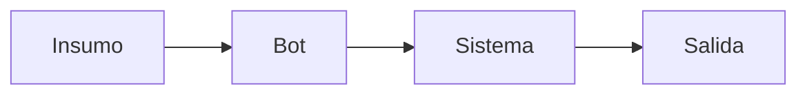

# ARQ-001 — Arquitectura de <Nombre del proyecto>

Vista técnica de conjunto. Los detalles de cada pieza viven en su propia
nota; esta las conecta y explica cómo encajan.

## Diagrama de bloques

Diagrama en Mermaid si el documento fuente permite reconstruirlo con
fidelidad. Si no, describirlo en prosa y decir que no hay diagrama en la
fuente — no dibujar una arquitectura inferida.

## Piezas

- **Plataforma RPA:** [[Sistema - plataforma-rpa]] — versión, orquestador,
  tipo de licenciamiento, modo de ejecución (atendido / desatendido)
- **ERP / SAP:** [[Sistema - sap]] — módulos, transacciones, tipo de acceso
  (GUI scripting, BAPI, RFC, interfaz)
- **Bases de datos:** [[Sistema - nombre-bd]] — motor, esquema, tipo de
  operación (lectura / escritura)
- **Aplicaciones y servicios:** [[Sistema - ...]] — web, escritorio, APIs,
  colas
- **Ambientes:** [[Ambiente - ...]]
- **Accesos:** [[Acceso - ...]]

## Integraciones

Cómo se comunican las piezas: archivo compartido, API REST, cola, base de
datos intermedia, RPA haciendo de puente. Marcar cuáles son frágiles.

## Dependencias externas

De qué depende el proceso y que está fuera de su control (otro bot, un
proveedor, un job programado, un cierre contable).

## Depende de
- [[Sistema - nombre-sistema]]

## Extraído de
- [[Documento - nombre-del-documento]]
